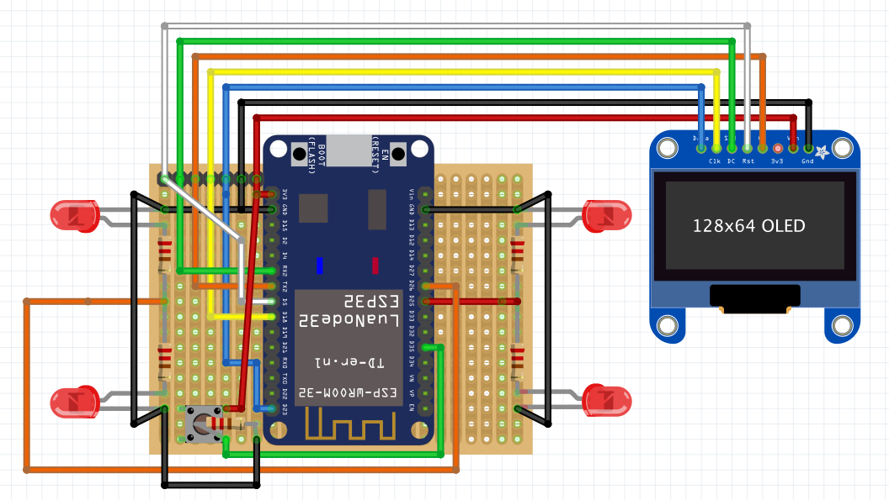
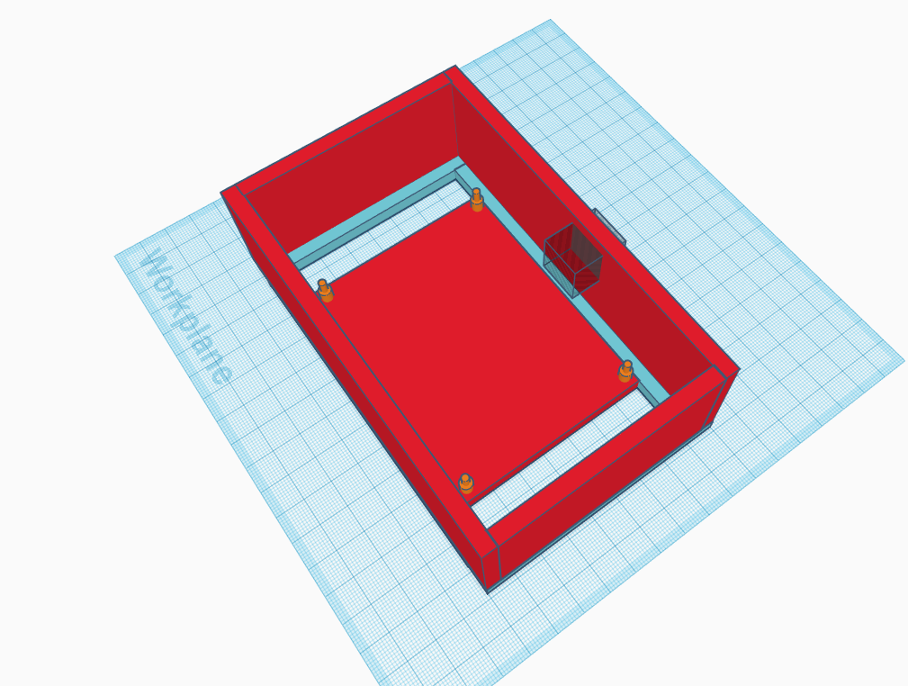
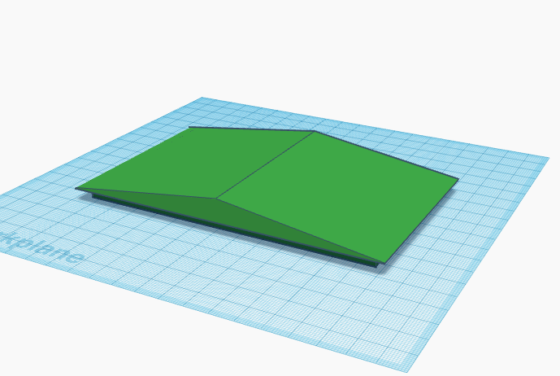
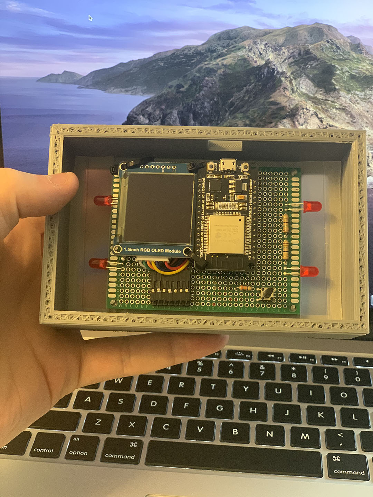

## LoveCube

A Wifi Enabled Message Box based on the ESP32

-----

LoveCube is an Open Source software and hardware version of the [LoveBox](https://en.lovebox.love).

All wirinng diagrams, code, and 3D models are available in this repository. The Love Box is $100, which I thought was way too much for a chip and a box. The love cube can be made for signifigantly less, has the potential to have a lot more functionality, and doesn't have the ugly ass heart on the front of it to notify a new message (this has been replaced with slick underglow LEDs).

In it's current state, its pretty insecure, you have to send the server REST messages through postman (or god forbid your browser) so it's in a janky state right now (but it works!).

   
  (I ended up using a larger prototyping board than when I made this design)
  
   
  

### So how much did it does it cost to make this?

1 ESP-32 is $6.49 from [Amazon](https://www.amazon.com/HiLetgo-Internet-Development-Wireless-Micropython/dp/B010O1G1ES/ref=sr_1_2_sspa?dchild=1&keywords=ESP32&qid=1596591717&sr=8-2-spons&psc=1&spLa=ZW5jcnlwdGVkUXVhbGlmaWVyPUExSTBKREhNNEo1Q1dUJmVuY3J5cHRlZElkPUEwNzExMzQxMlBXUlczS0I2NUlFRSZlbmNyeXB0ZWRBZElkPUEwNzkyNTgyMzdMMEZQN0Y2WjBPSCZ3aWRnZXROYW1lPXNwX2F0ZiZhY3Rpb249Y2xpY2tSZWRpcmVjdCZkb05vdExvZ0NsaWNrPXRydWU=). Though I bought mine in a pack of 5 to save a few bucks.

1 1.5 Inch RGB OLED Display ~~was 16.50~~ is now 19.35 from [Amazon](https://www.amazon.com/gp/product/B07DGS1W6L/ref=ppx_yo_dt_b_asin_title_o05_s00?ie=UTF8&psc=1). I like this display, its really bright, responsive, and clear, though its a little expensive, I'm sure a dedicated soul could find a better replacement.

The Box was a 200g print so assuming your filament is $20, it was a $4 print. 

Total: $27.00 much cheaper than the $100 LoveBox.

### Hey you have a lot more pictued there! I don't have a 3D Printer! I don't have any of this stuff! I want to do stuff like this!

If you're looking to build this or anything else (and you've got nothing!) here's some stuff I reccomend getting:

* Rolls of 22 awg wire. When doing stuff on a prototyping board you obviously need wire. You can get some wire like [this](https://www.amazon.com/gp/product/B07TX6BX47/ref=ppx_yo_dt_b_asin_title_o01_s00?ie=UTF8&psc=1) for a pretty good price.

* I like using prototyping boards for this kind of stuff, it makes it easy to build things like this quickly. Any kind of prototyping boards will do, they're all basically the same, though make sure you get risers and stuff too! You can usually get them in a pack and it saves you from soldering your chips and expensive componants right into a board you might not keep around. Prototyping boards are made to be destroyed!

* I will reccomend an ESP-32 over an Arduino 8 days a week. Not only are they signifigantly cheaper, they are infinitely more useful. Plus anything written for an arduino is easily ported to work on an ESP-32

* [The TS80/TS80P soldering iron](https://www.amazon.com/UY-CHAN-Programmable-Pocket-size-Soldering/dp/B07G71CKC4/ref=sr_1_4?dchild=1&keywords=TS80+soldering+iron&qid=1596592671&s=hi&sr=1-4) Is the best, most usable iron ive ever used. 10/10 worth the money.

* [The Ender 3](https://www.creality3dofficial.com/products/official-creality-ender-3-3d-printer) is the de-facto beginner 3D printer. It goes on sale often and is a quality 3D Printer. Also would reccomend. Its kinda slow, but thats okay. 

